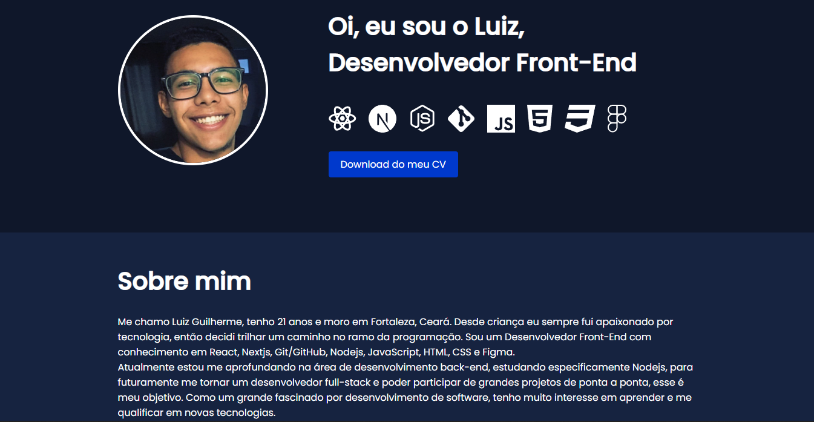

<h1 align="center"> Portfólio </h1>

  <a href="#-tecnologias">Tecnologias</a>&nbsp;&nbsp;&nbsp;|&nbsp;&nbsp;&nbsp;
  <a href="#-projeto">Projeto</a>&nbsp;&nbsp;&nbsp;|&nbsp;&nbsp;&nbsp;
  <a href="#memo-licença">Licença</a>

  

 

  

## 💻 Deploy

Você pode visualizar o deploy do portfólio através [DESSE LINK](https://portfolio-luizguilherme4.vercel.app/).

## :memo: Licença

Esse projeto está sob a licença MIT.

---

Feito com ♥ by Luiz :wave:
